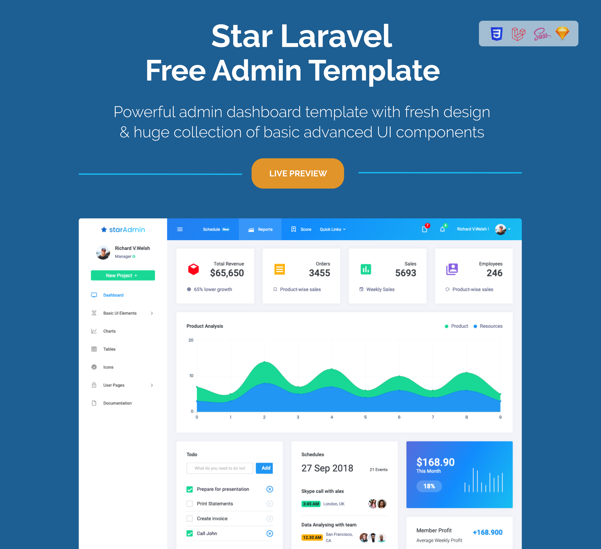

# Star Admin Free Laravel Admin Template


Star Admin Laravel Admin Template is a free admin template based on Bootstrap 4 and Laravel. 

This is a completely responsive and mobile-first admin template that provides a great foundation for your Bootstrap + Laravel project.

This remarkably flexible and highly customizable template helps you create an amazing UI for your admin panel.

## Demo

Visit: http://www.bootstrapdash.com/demo/star-laravel-free/template/

[](http://www.bootstrapdash.com/demo/star-laravel-free/template/)

## Installation

### What's included

Within the download you'll find the following directories and files, logically grouping common assets and providing both compiled and minified variations. You'll see something like this:

```
StarAdmin-Free-Laravel-Admin-Template/
├── documentation/
├── template/
├── README.md
├── preview.jpg

```

### Usage

``` bash
# clone the repo
$ git clone https://github.com/BootstrapDash/StarAdmin-Free-Laravel-Admin-Template.git

# Go to app's directory
$ cd StarAdmin-Free-Laravel-Admin-Template/template/

# Install dependencies
npm install
composer install

# Rename .env.example to .env

# Generate key
php artisan key:generate

# serve project
php artisan serve
npm run watch

# build for production with minification
npm run prod
```

For a detailed explanation on how things work, please check out [our documentation](https://www.bootstrapdash.com/demo/star-laravel-free/documentation/documentation.html)
